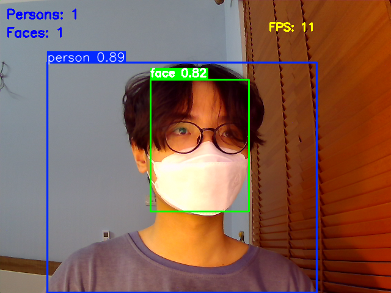

# Hệ Thống Nhận Diện Người và Khuôn Mặt Bằng YOLO  

Hệ thống phát hiện người và khuôn mặt thời gian thực sử dụng mô hình YOLO, hiển thị FPS và thống kê số lượng.  

## **Mục lục**  
- [Tính năng](#tính-năng)  
- [Cấu trúc dự án](#cấu-trúc-dự-án)  
- [Cài đặt](#cài-đặt)  
- [Cách sử dụng](#cách-sử-dụng)  
- [Cấu hình](#cấu-hình)  
- [Tài liệu module](#tài-liệu-module)  
  - [config.py](#configpy)  
  - [models.py](#modelspy)  
  - [detector.py](#detectorpy)  
  - [visualizer.py](#visualizerpy)  
  - [video.py](#videopy)  
  - [main.py](#mainpy)  
- [Phụ thuộc](#phụ-thuộc)  
- [Xử lý sự cố](#xử-lý-sự-cố)  
- [Giấy phép](#giấy-phép)  

---

## **Tính năng**  
- Phát hiện người thời gian thực bằng YOLO(nano)  
- Phát hiện khuôn mặt trong vùng chứa người  
- Hiển thị FPS  
- Thống kê số lượng:  
  - Người được phát hiện  
  - Khuôn mặt được nhận diện  
- Điểm tin cậy cho khuôn mặt  
- Điều khiển bằng bàn phím (Nhấn **Q** để thoát)  

---

## **Cấu trúc dự án**  
```bash  
yolo-human-face-detection/  
├── config.py        # Cấu hình và hằng số  
├── models.py        # Hàm tải mô hình  
├── detector.py      # Logic nhận diện  
├── visualizer.py    # Tiện ích hiển thị  
├── video.py         # Xử lý video  
├── main.py          # Vòng lặp chính  
├── requirements.txt # Danh sách phụ thuộc  
├── README.md  
```  

---

## **Cài đặt**  
1. **Clone repository**:  
```bash  
git clone https://github.com/hai4h/yolo-human-face-detection.git  
cd yolo-human-face-detection  
```  

2. **Thiết lập môi trường và cài đặt phụ thuộc**:  
```bash  
python -m venv venv  
source venv/bin/activate  
pip install ultralytics  
```  

3. **Tải mô hình YOLO**:  
- Đặt `yolo11n.pt` (mô hình nhận diện người) và `yolo8n-face-640-50epochs.pt` (mô hình nhận diện khuôn mặt) vào thư mục gốc.  
- Hoặc sửa đường dẫn trong `config.py` để trỏ đến mô hình tùy chỉnh.  

---

## **Cách sử dụng**  
```bash  
python main.py  
```  
- Nhấn **Q** để thoát.  
- Kết quả hiển thị theo thời gian thực:  
   *(Ví dụ khi chạy trong thực tế)*  

---

## **Cấu hình**  
Sửa `config.py` để tùy chỉnh:  
```python  
# Cấu hình phần cứng (chỉ dành cho AMD GPU với ROCm)  
putenv("HSA_OVERRIDE_GFX_VERSION", "10.3.0")  

# Đường dẫn mô hình  
PERSON_MODEL_PATH = 'yolo11n.pt'      # Đường dẫn mô hình nhận diện người  
FACE_MODEL_PATH = 'yolo8n-face-640-50epochs.pt'  # Đường dẫn mô hình nhận diện khuôn mặt  

# Tham số hiển thị  
PERSON_COLOR = (0, 0, 255)    # Màu đỏ cho khung người  
FACE_COLOR = (0, 255, 0)      # Màu xanh lá cho khung khuôn mặt  
TEXT_SCALE = 0.6              # Kích thước chữ  
TEXT_THICKNESS = 2            # Độ dày nét vẽ  
```  

---

## **Tài liệu module**  

### **`config.py`**  
Chứa cài đặt môi trường và hằng số:  
- Cấu hình phần cứng cho AMD GPU  
- Đường dẫn mô hình  
- Tham số hiển thị (màu sắc, kích thước chữ)  

### **`models.py`**  
**Hàm chính**:  
- `load_models()`: Khởi tạo mô hình YOLO cho nhận diện người và khuôn mặt.  

**Giá trị trả về**:  
- Tuple chứa hai đối tượng YOLO: `(person_model, face_model)`  

### **`detector.py`**  
**Lớp chính**:  
- `Detector`: Xử lý logic nhận diện chính.  

**Phương thức**:  
| Phương thức | Tham số | Giá trị trả về | Mô tả |  
|------------|---------|----------------|-------|  
| `process_frame` | `frame: np.ndarray` | `(annotated_frame, person_count, face_count, face_boxes)` | Xử lý khung hình qua pipeline |  
| `_prepare_rois` | `frame`, `boxes` | `(valid_rois, valid_indices)` | Trích xuất vùng quan tâm (ROI) từ khung người |  
| `_detect_faces` | `rois`, `indices`, `boxes` | `{"count": int, "boxes": list}` | Nhận diện khuôn mặt trong ROI |  

### **`visualizer.py`**  
**Hàm chính**:  
- `draw_faces()`: Vẽ khung và nhãn tin cậy cho khuôn mặt.  
- `draw_ui()`: Hiển thị thống kê số lượng và FPS.  

### **`video.py`**  
**Lớp chính**:  
- `VideoCapture`: Quản lý việc đọc và giải phóng video/webcam.  

**Phương thức**:  
| Phương thức | Mô tả |  
|------------|-------|  
| `read_frame()` | Trả về tuple `(ret, frame)` |  
| `release()` | Giải phóng tài nguyên |  
| `is_opened()` | Kiểm tra trạng thái kết nối |  

### **`main.py`**  
Luồng chính của ứng dụng:  
1. Khởi tạo camera và detector.  
2. Vòng lặp xử lý từng khung hình:  
   - Nhận diện người và khuôn mặt  
   - Vẽ khung và thống kê  
   - Hiển thị kết quả  

---

## **Phụ thuộc**  
- Python 3.10+ (Khuyến nghị 3.12+)  
- Các thư viện cần thiết:  
  ```bash  
  pip install ultralytics opencv-python numpy  
  ```  

---

## **Xử lý sự cố**  
**1. Lỗi tải mô hình**  
- Kiểm tra đường dẫn mô hình trong `config.py`.  
- Đảm bảo phiên bản Ultralytics và PyTorch tương thích.  

**2. Không truy cập được webcam**  
- Kiểm tra xem camera có đang bị ứng dụng khác sử dụng không.  
- Thử đổi chỉ số nguồn video (ví dụ: `VideoCapture(1)`).  

**3. FPS thấp**  
- Giảm độ phân giải đầu vào.  
- Kích hoạt FP16 bằng `half=True` (nếu GPU hỗ trợ).  

**4. Lỗi AMD GPU**  
- Xóa dòng `putenv("HSA_OVERRIDE_GFX_VERSION", "10.3.0")` trong `config.py` nếu không dùng AMD GPU hoặc ROCm không được hỗ trợ.  
- Cập nhật driver ROCm.  

---

## **Giấy phép**  
[MIT License](LICENSE) - Miễn phí cho mục đích học thuật và thương mại, yêu cầu ghi công.